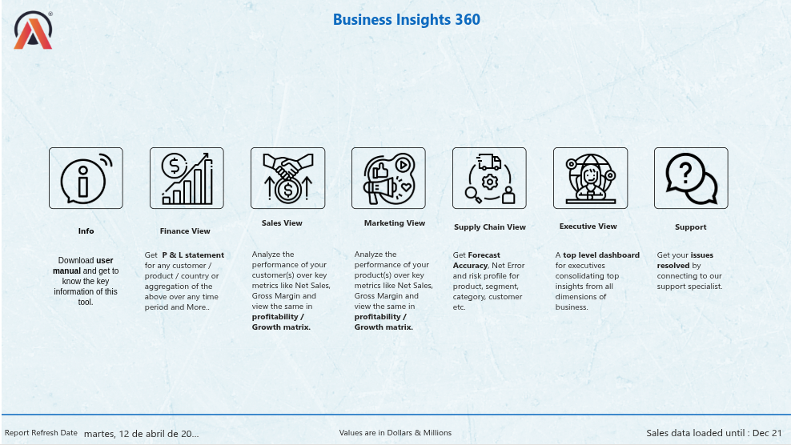
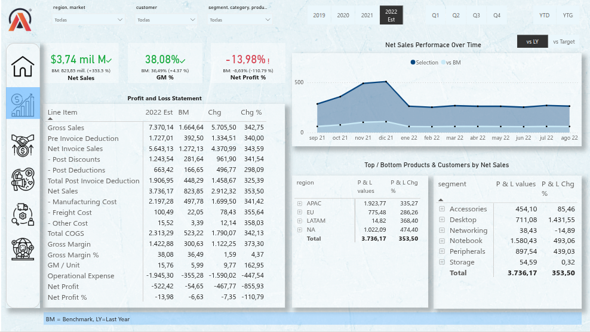
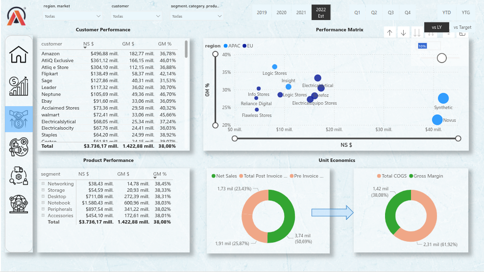
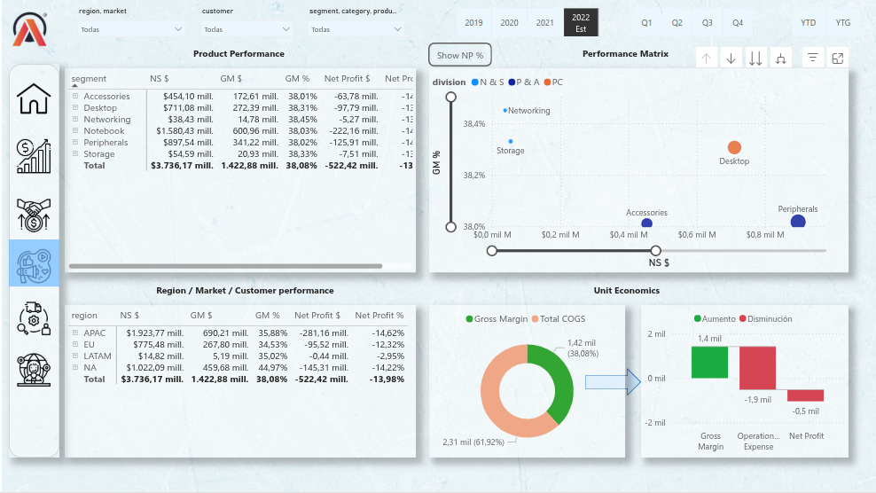
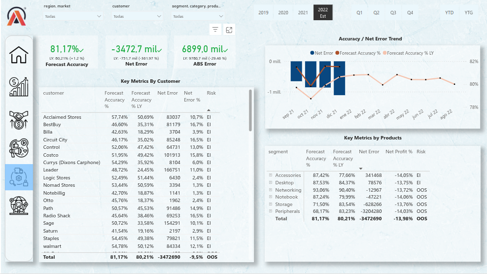
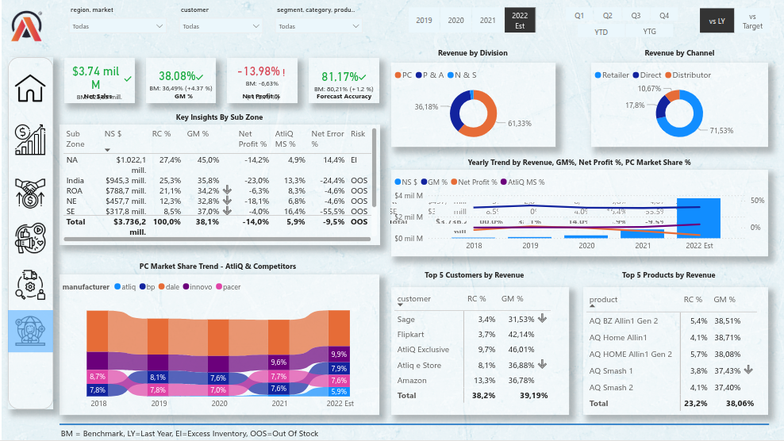

# 📊 Business Analytics Dashboard – AtliQ

This project is a **business analytics dashboard** for AtliQ, a fictional hardware company.  
It was developed as part of the [Power BI for Business Analytics Course](https://codebasics.io/courses/power-bi-data-analysis-with-end-to-end-project) by Codebasics.  

---

## Project Link
- https://app.powerbi.com/view?r=eyJrIjoiYmQ2ZGU4ZjMtZWY5Yi00NmZlLTk0ZDctOGU1MmY0OWMzMjdhIiwidCI6ImM2ZTU0OWIzLTVmNDUtNDAzMi1hYWU5LWQ0MjQ0ZGM1YjJjNCJ9
---

## 🚀 Project Overview
- Designed an **interactive Power BI dashboard** to analyze AtliQ’s sales and financial performance.  
- Transformed and modeled raw data using **Power Query**.  
- Created **visualizations and KPIs** to help stakeholders make data-driven decisions.  

---

## 🧠 Key Learnings
1. **Data Transformation**  
   - Cleaning and shaping data with Power Query  
   - Handling missing values and inconsistent data  

2. **Data Modeling**  
   - Building relationships between multiple tables  
   - Understanding star schemas and fact/dimension tables  

3. **Dashboard Development**  
   - Creating charts, slicers, and custom measures (DAX)  
   - Designing user-friendly and interactive dashboards  

4. **Business Insights**  
   - Revenue trends and profit margins  
   - Regional sales performance  
   - Year-over-Year (YoY) comparisons  

---

## 🛠️ Tools & Technologies
- **Power BI** (Data Visualization & Reporting)  
- **Power Query** (Data Cleaning & Transformation)  
- **DAX** (Data Analysis Expressions for calculated fields)  
- **Excel/CSV** (Data Sources)  

---

## 📸 Dashboard Preview
### Home View
  
**Finance View** 
  
**Sales View**  

**Marketing View**  

**Supply Chain View**  

**Executive View**  

---
## 🙌 Acknowledgements
This project is inspired by the **Codebasics Power BI course**.  
Big thanks to [Codebasics](https://codebasics.io/) for providing structured learning content.  
